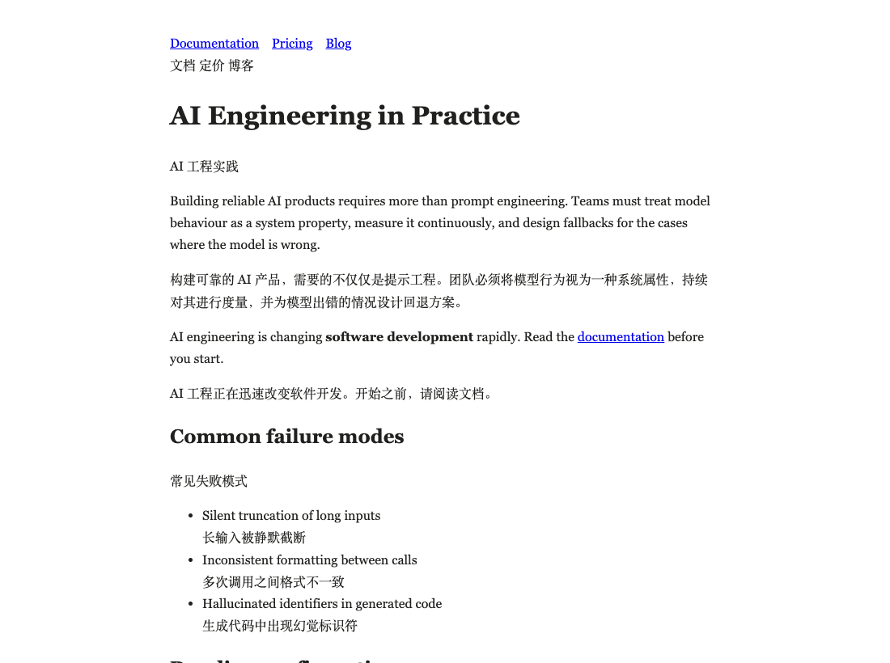
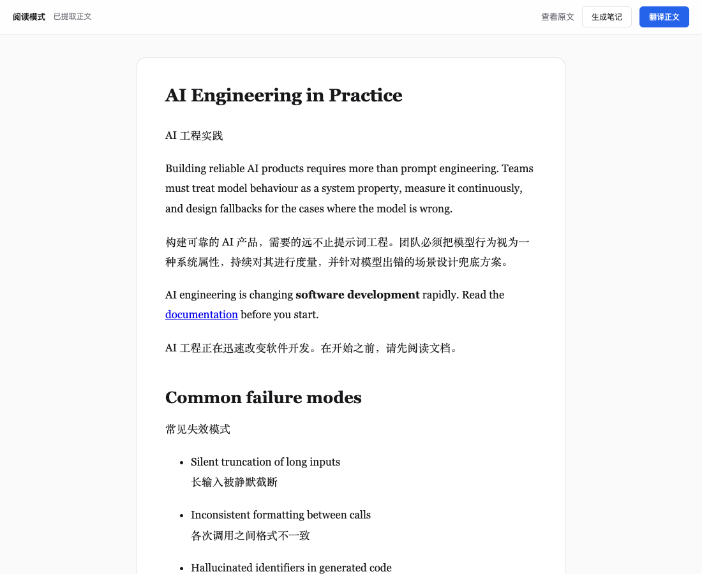
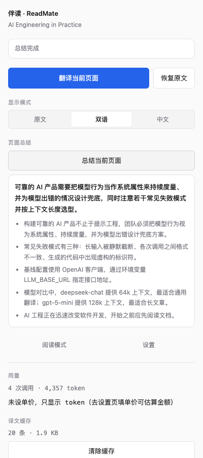
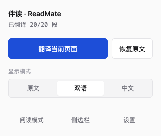

# 伴读 · ReadMate

> 读外文网页时，**看得懂、抓得住、记得住**。

一个浏览器扩展 + 本地 FastAPI 服务，把「翻译 → 阅读 → 笔记」串成一条链路。

四件事：

- **翻译** —— 双语 / 纯中文 / 原文，随时切换
- **阅读模式** —— 剥掉导航与广告，只留正文
- **总结** —— 选中一段，或整页
- **学习笔记** —— 从文章里提取概念、大纲、结论，可导出 Markdown



> 截图用的是仓库内的测试页面（`extension/tests/fixtures/pages/`），
> 不是真实网站——你可以复现同样的效果。

**设计上的两条取舍：**

- **模型和数据都是你自己的。** 任何 OpenAI 兼容的服务都能接，
  Key 存在你自己机器的 `.env` 里，翻译内容只经过你的机器
- **扩展只做 UI 与 DOM，AI 能力全在本地服务。**
  所以换模型不用重新打包扩展

---

## 目录

- [成本](#成本)
- [隐私](#隐私)
- [快速开始](#快速开始)
- [怎么用](#怎么用)
- [换模型 / 换 Provider](#换模型--换-provider)
- [工作原理](#工作原理)
- [项目状态](#项目状态)
- [已知限制](#已知限制)
- [权限说明](#权限说明)
- [开发](#开发)
- [许可证](#许可证)

---

## 成本

用 DeepSeek flash（闲时价）实测：

| 操作 | 消耗 | 成本 |
| --- | --- | --- |
| 翻译一篇 26 段的长文 | 输入 1438 / 输出 967 token | **¥0.0053** |
| 生成一次学习笔记 | 输入 ~2100 / 输出 ~4600 token | **¥0.021** |
| **「翻译 + 笔记」一篇** | | **≈ ¥0.026** |

按这个单价，读 100 篇约 ¥2.6。

译文有缓存，同一篇文章再看一次不再计费。

> 价格随 Provider 与时段变化，**以各家官方文档为准**。
> 扩展里可以自己填单价来估算金额——默认只报 token 数，
> 因为内置一份会过期的价格表没有意义。

---

## 隐私

```text
浏览器扩展  ──HTTP──▶  本地 FastAPI  ──HTTPS──▶  LLM 服务商
（不含 Key）            （Key 存在这里）           （只看到请求）
```

- **扩展里永远没有 Key**，它只跟 `127.0.0.1` 说话
- **Key 只存在服务端 `.env`**，文件权限 600，且被 `.gitignore` 排除
- **服务端不返回 Key**——设置页只告诉你「已配置 / 未配置」
- 翻译内容不经过任何中间服务器

> ⚠️ 把服务端部署到公网前，**必须先加认证与 HTTPS**。
> 当前服务端没有认证，靠绑定 `127.0.0.1` 保护。
> 详见[已知限制](#已知限制)。

---

## 快速开始

需要 **Node 20+** 与 **Python 3.13**。

### 1. 启动本地服务

```bash
cd server
python3.13 -m venv .venv
.venv/bin/pip install -r requirements.txt

cp .env.example .env
# 编辑 .env，填三行：
#   LLM_API_KEY=<你的 key>
#   LLM_BASE_URL=https://api.deepseek.com/v1
#   LLM_MODEL=deepseek-flash

.venv/bin/uvicorn app.main:app --host 127.0.0.1 --port 8000
```

验证：

```bash
curl http://127.0.0.1:8000/api/v1/health
# {"status":"ok","provider":"openai_compatible","model":"deepseek-flash",...}
```

> **Windows**：把 `.venv/bin/` 换成 `.venv\Scripts\`、`python3.13` 换成 `py -3.13`。
> 代码本身是跨平台的，`npm run test:e2e` 两端同一条命令。

### 2. 构建并加载扩展

```bash
cd extension
npm install
npm run build
```

`chrome://extensions` → 打开**开发者模式** → **加载已解压的扩展程序** →
选 `extension/.output/chrome-mv3`

### 3. 打开一个英文网页，点扩展图标，点「翻译当前页面」

首屏内容优先翻译，往下滚动时进入视口的部分会自动补上——**不用等整页翻完**。

> **页面下方还是英文？** 这是有意的：为了不让首屏等太久、也不白花 token，
> 只翻「看得见 + 即将看得见」的部分。往下滚就会补；
> **滚到页面底部时，剩下的会一次性全部翻完**——直接按 `End` 跳到底也一样。
> 状态栏里的「其余滚动时自动翻译」说的就是这件事，不是失败。

---

## 怎么用

### 键盘快捷键与右键菜单

| 入口 | 作用 |
| --- | --- |
| `Alt+T` | 翻译当前页面 |
| `Alt+R` | 恢复原文 |
| `Alt+Shift+R` | 用阅读模式打开当前页面 |
| 右键 → 翻译这个页面 | 同上第一条（选中文字时另有「AI 解释」「总结选中的内容」） |
| 右键 → 恢复原文 | 同上第二条 |
| 右键 → 用阅读模式打开 | 同上第三条 |

macOS 上显示为 `⌥T` / `⌥R` / `⌥⇧R`。可以在 `chrome://extensions/shortcuts`
里改成自己喜欢的键——Popup 底部那行提示显示的**永远是你当前生效的键**，
没生效的键不会出现在那里。

### 三种显示模式

| 模式 | 效果 |
| --- | --- |
| **原文** | 不翻译。切到它会停止正在进行的翻译 |
| **双语** | 原文保留，译文追加在下面 |
| **中文** | 译文就地替换原文 |

随时可以切回原文，页面 DOM 会还原到翻译前的状态。

### 阅读模式

剥掉导航、广告、侧边栏，只留正文。正文用衬线字体——长文更好读。



### 总结与学习笔记

两个不同的东西：

| | 总结 | 学习笔记 |
| --- | --- | --- |
| 输出 | 一段话 + 3–5 个要点 | 定位、概念、大纲、结论 |
| 用途 | 快速判断值不值得读 | 读完留下点东西 |
| 入口 | 选中文字右键 / 侧边栏 | 阅读模式里的「生成笔记」 |

都能导出 Markdown。

### 侧边栏

常驻控制台：状态、显示模式、页面总结、用量、缓存。



### Popup



### AI 解释

选中一段文字 → 右键 → 「AI 解释」。解释以浮层显示在页面上，
可以追问。

---

## 换模型 / 换 Provider

**任何 OpenAI 兼容的服务都能用**，换一家只改地址和模型名。

### 方式一：在扩展里改（推荐）

```text
Popup → 设置 → 「模型服务」
```

填接口地址、两个模型名、API Key，点「保存到服务端」——**立即生效，不用重启**。

> **API Key 只进不出**：保存后输入框立即清空，
> 浏览器也永远读不到它的值。

### 方式二：直接编辑 `.env`

```env
LLM_API_KEY=<你的 key>
LLM_BASE_URL=https://api.deepseek.com/v1
LLM_MODEL=deepseek-flash
```

常见 Provider 的地址：

| Provider | `LLM_BASE_URL` |
| --- | --- |
| DeepSeek | `https://api.deepseek.com/v1` |
| OpenRouter | `https://openrouter.ai/api/v1` |
| 硅基流动 | `https://api.siliconflow.cn/v1` |
| 月之暗面 | `https://api.moonshot.cn/v1` |
| 本地 Ollama | `http://127.0.0.1:11434/v1` |

> 模型名与价格随时会变，**以各家官方文档为准**。
> 想确认某个名字还有效（只读，不花钱）：
>
> ```bash
> curl -H "Authorization: Bearer $LLM_API_KEY" $LLM_BASE_URL/models
> ```

### 可以用两个模型

| 配置项 | 管哪些接口 | 建议 |
| --- | --- | --- |
| `LLM_MODEL` | 翻译、AI 解释 | 便宜快的就够——翻译是转换 |
| `LLM_SUMMARY_MODEL` | 总结、学习笔记 | 可以换个更强的——要抓主旨、提炼概念 |

`LLM_SUMMARY_MODEL` **留空就回落到 `LLM_MODEL`**。

---

## 工作原理

```text
┌─ 浏览器扩展（只做 UI 与 DOM）─────────────────────────┐
│  content script                                       │
│    segmenter  DOM → 翻译单元（Block），带占位符保护结构 │
│    queue      并发、重试、降级（唯一调度点）            │
│    renderer   译文写回 DOM，随时可还原                 │
│    viewport   只翻视口附近的；滚到页面底部会把剩下的翻完│
│    mutation   动态加载的内容自动接入                   │
│    route      SPA 换页自动重来                         │
│  popup / sidepanel / options / reader                 │
└───────────────────────┬───────────────────────────────┘
                        │ HTTP（只连 127.0.0.1）
┌───────────────────────▼───────────────────────────────┐
│  本地 FastAPI 服务                                     │
│    Router → Service → Prompt → LLMClient              │
│    译文缓存 · 用量台账 · Prompt 组装                    │
└───────────────────────┬───────────────────────────────┘
                        │ HTTPS
                   LLM 服务商
```

### 几个关键设计

**结构保护用占位符。** 段落里的 `<a>`、`<code>` 这些行内元素会被换成
`<0>...</0>` 送给模型，模型按目标语言语序重排，回来后再把原元素填回去。
**结构校验失败绝不渲染**——宁可保留原文，也不输出结构损坏的页面。

**行内代码用成对占位符。** `<code>useState()</code>` 变成
`<0>useState()</0>`——模型**看得见内容**（否则容易把它当噪声丢掉），
但改不动它。

**代码块整块跳过。** 判据是「等宽字体 + 块级显示」而不是标签名——
React 官方文档那类站点用 `<div>` + `<span>` 渲染代码，只认标签会漏掉。

**调度只有一个点。** 并发与排队只在 content script 里；
background 只做无状态转发。MV3 的 service worker 随时会被回收，
把队列放在那儿不安全。

---

## 项目状态

**版本 2.1.0。** 核心功能完整，日常可用。

```text
单元测试      597
端到端测试     91   真实 Chromium，发布门禁
服务端测试    218
──────────────────
合计          906
```

其他实测数据：

| 指标 | 数值 |
| --- | --- |
| 扩展包体 | 328 KB |
| 服务端常驻内存 | 75 MB |
| 分段耗时 | 约 0.1 ms / 段（1000 段约 92 ms）|
| 翻译一篇长文 | 约 4.7 s（含网络）|

---

## 已知限制

- **阅读模式依赖 Readability**，结构奇特的页面可能提不出正文
- **站点适配只有三个**（Twitter / Reddit / GitHub），其他站点走通用规则
- **AI 解释、右键菜单、侧边栏**这些原生 UI 没有自动化测试覆盖
  ——浏览器限制，测不到
- **代码块旁边的文件名标签**（如 Sandpack 的 `App.js`）仍会被翻译。
  影响很小（1 条），模型通常原样返回
- **双语模式的译文是纯文本**——行内结构（链接、等宽）不复制过去，
  否则页面上会出现两份链接。中文模式会保留结构
- ⚠️ **部署到公网前必须加认证与 HTTPS**。当前服务端没有认证，
  靠绑定 `127.0.0.1` 保护；暴露到公网等于把 Key 交出去

---

## 权限说明

| 权限 | 用途 |
| --- | --- |
| `activeTab` | 只在你点扩展时访问当前标签页 |
| `scripting` | 注入 content script |
| `storage` | 存设置与译文缓存 |
| `contextMenus` | 右键菜单（AI 解释 / 总结选中）|
| `sidePanel` | 侧边栏 |

**`host_permissions` 只包含 `http://127.0.0.1:8000/*`**——
扩展默认只能访问你本机的服务，**访问不了任何其他网站**。

例外只有一个，而且是**你自己点头才生效**：把设置页的「服务地址」改成别的
（比如局域网里另一台机器、换个端口）时，保存会弹一次浏览器的授权框，
问你要不要放行那个站点。这一步走的是 `optional_host_permissions`（可选权限）
——它**不产生安装时的权限提示**，不改地址就不会用到；不点「允许」，
扩展仍然访问不了任何其他网站。

---

## 开发

```bash
# 扩展
cd extension
npm run dev          # 开发模式（热更新）
npm run lint         # Biome
npm run typecheck    # tsc
npm test             # Vitest 单元测试
npm run test:e2e     # Playwright 端到端（发布门禁）

# 服务端
cd server
.venv/bin/python -m pytest
```

`npm run test:e2e` 会自动拉起两个服务（fixture 页 + mock 的 FastAPI），
**不发起真实模型请求**。跑之前先停掉占用 8000 / 8001 的本机服务。

> **关于代码注释里的「方案第 X 节」**
>
> 你会看到 `（方案第 62 节）` 这类引用——它指向本项目**内部的设计文档**，
> 未包含在本仓库中。保留下来是为了让注释与设计决策可追溯，
> **不影响阅读代码**：每条注释本身都写清了「为什么」。

---

## 许可证

[MIT](LICENSE) © 2026 Linyun777

本项目使用了 [@mozilla/readability](https://github.com/mozilla/readability)（Apache-2.0），
归属声明见 [NOTICE](NOTICE)。
